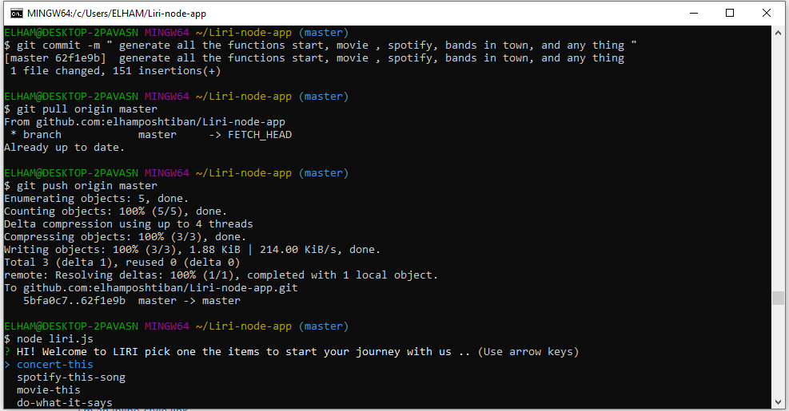
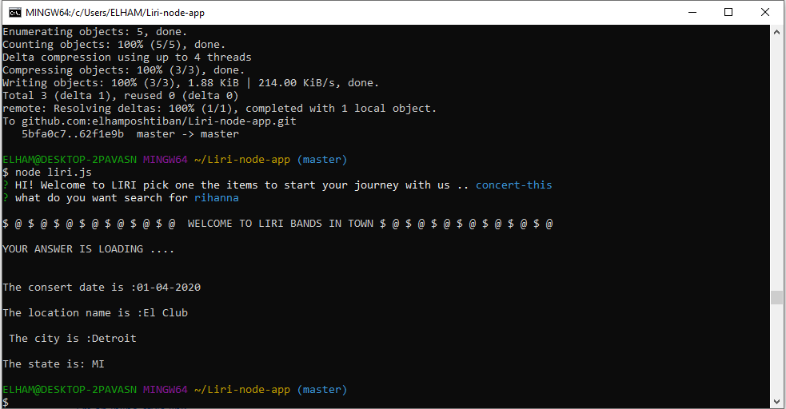
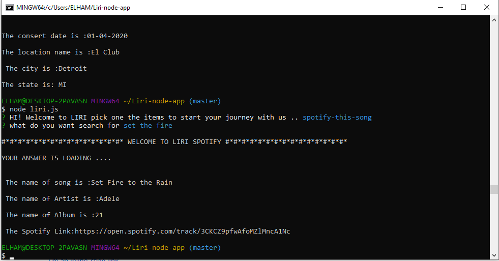
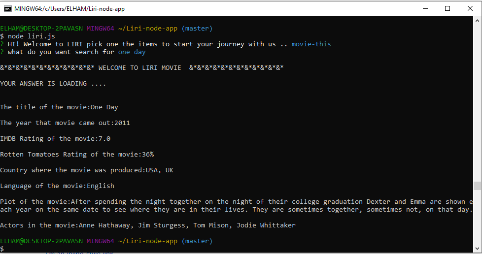
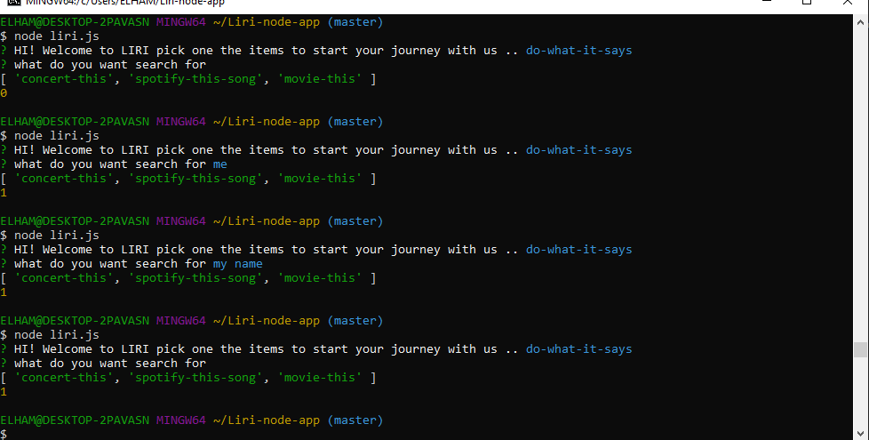
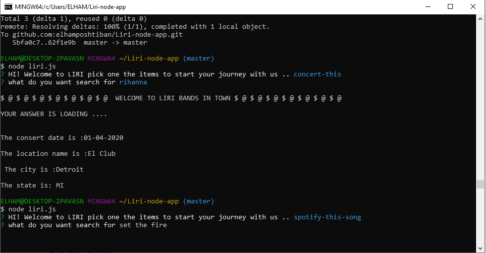

# Liri-node-app

LIRI is like iPhone's SIRI. However, while SIRI is a Speech Interpretation and Recognition Interface, LIRI is a Language Interpretation and Recognition Interface. LIRI will be a command line node app that takes in parameters and gives you back data.LIRI will search Spotify for songs, Bands in Town for concerts, and OMDB for movies.

## Tech Stack

•	What languages is it written with?  node.js.  
•	the package i used : npm , spotify, axios, inquirer, moment

 ## API KEY

 •	 OMDB api key, spotify api key, bands in town api key

 ##  Previews of App 
  questions:    
 
 consert function:    
 
 spotify function:    
 
 movie function:   
 
 anything function:   
 
 input for search:    

